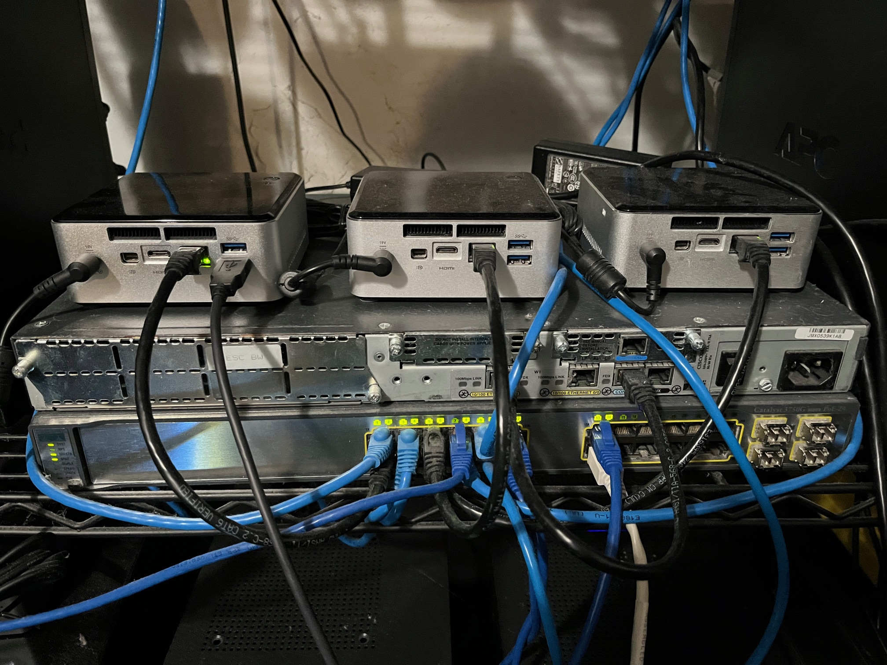
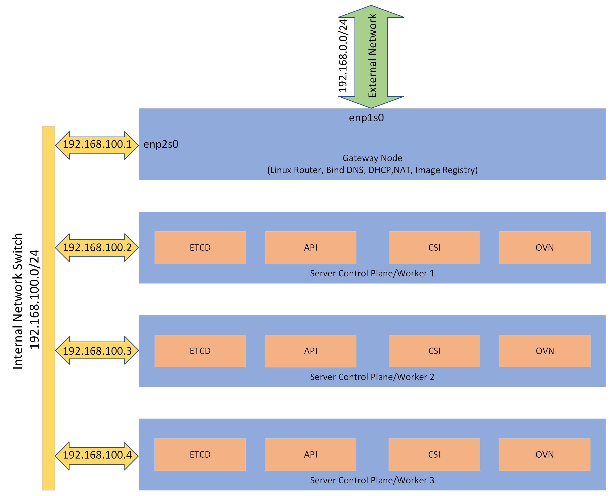

# **Simplicity of Linux Routing Brings OpenShift Portability**

Anyone who has ever done a proof of concept at a customer site knows how daunting it can be.  There is allocating the customers environment from a physical space perspective, power and cooling and then the elephant in the room networking.   Networking always tends to be the most challenging because the way a customer architects and secures their network varies from each and every customer.   Hence when delivering a proof of concept wouldn't it be awesome if all we needed was a single ipaddress and uplink for connectivity?   Linux has always given us the capability to provide such a simple elegant solution.  It's the very reason why router distros like OPNsense, OpenWRT, pfSense and IPFire are based on Linux.  In the following blog I will review configuring such a state with the idea of providing the simplicity of a single uplink for a proof of concept.

In this example I wanted to deliver a working Red Hat OpenShift compact cluster that I could bring anywhere.   A fourth node acting as the gateway box will also run some infrastructure components with a switch to tie it all together.  In the diagram below we can see the layout of the configuration and how the networking is setup.  I should note this could use four physical boxes or in my testing I had all 4 nodes virtualized on a single host.   We can see I have a interface enp1s0 on the gateway node that is connected to the upstream network or maybe even the internet depending on circumstances and then another internal interface enp2s0 which is connected to the internal network switch.  All the OpenShift nodes are connected to the internal network switch as well.  The internal network will never change but the external network could be anything and could change if we wanted it to.   What this means when bringing this setup to another location is I just need to update the enp1s0 interface with the right ipaddress, gateway and nameserver.   Further to ensure the OpenShift api and ingress wildcards resolve the external DNS (whatever controls that) will need those two records added and pointed to the enp1s0 interface ipaddress.  Nothing changes on the OpenShift cluster nodes or gateway node configurations of dhcp or bind.

The gateway node has Red Hat Enterprise Linux 9.3 installed on it along with dhcp and bind services both of which are listening only on the internal enp2s0 interface.  Below is the dhcpd.conf config I am using.

~~~bash
cat /etc/dhcp/dhcpd.conf
option domain-name "schmaustech.com";
option domain-name-servers 192.168.100.1;
default-lease-time 1200;
max-lease-time 1000;
authoritative;
log-facility local7;

subnet 192.168.100.0 netmask 255.255.255.0 {
        option routers                  192.168.100.1;
        option subnet-mask              255.255.255.0;
        option domain-search            "schmaustech.com";
        option domain-name-servers      192.168.100.1,192.168.100.1;
        option time-offset              -18000;     # Eastern Standard Time
	range   192.168.100.225   192.168.100.240;
        next-server 192.168.100.1;
        if exists user-class and option user-class = "iPXE" {
            filename "ipxe";
        } else {
            filename "pxelinux.0";
        }
        class "httpclients" {
          match if substring (option vendor-class-identifier, 0, 10) = "HTTPClient";
          option vendor-class-identifier "HTTPClient";
          filename "http://192.168.100.246/arm/EFI/BOOT/BOOTAA64.EFI";
    }
}

host adlink-vm1 {
   option host-name "adlink-vm1.schmaustech.com";
   hardware ethernet 52:54:00:89:8d:d8;
   fixed-address 192.168.100.128;
}

host adlink-vm2 {
   option host-name "adlink-vm2.schmaustech.com";
   hardware ethernet 52:54:00:b1:d4:9d;
   fixed-address 192.168.100.129;
}

host adlink-vm3 {
   option host-name "adlink-vm3.schmaustech.com";
   hardware ethernet 52:54:00:5a:69:d1;
   fixed-address 192.168.100.130;
}

host adlink-vm4 {
   option host-name "adlink-vm4.schmaustech.com";
   hardware ethernet 52:54:00:ef:25:04;
   fixed-address 192.168.100.131;
}

host adlink-vm5 {
   option host-name "adlink-vm5.schmaustech.com";
   hardware ethernet 52:54:00:b6:fb:7d;
   fixed-address 192.168.100.132;
}

host adlink-vm6 {
   option host-name "adlink-vm6.schmaustech.com";
   hardware ethernet 52:54:00:09:2e:34;
   fixed-address 192.168.100.133;
}
~~~

And the named.conf and schmaustech.com zone files I have configured.

~~~bash
$ cat /etc/named.conf
options {
	listen-on port 53 { 127.0.0.1; 192.168.100.1; };
	listen-on-v6 port 53 { any; };
	forwarders { 8.8.8.8; };
	directory 	"/var/named";
	dump-file 	"/var/named/data/cache_dump.db";
	statistics-file "/var/named/data/named_stats.txt";
	memstatistics-file "/var/named/data/named_mem_stats.txt";
	recursing-file  "/var/named/data/named.recursing";
	secroots-file   "/var/named/data/named.secroots";
        allow-query	{ any; };
	recursion yes;
	dnssec-enable yes;
	dnssec-validation yes;
	dnssec-lookaside auto;
	bindkeys-file "/etc/named.root.key";
	managed-keys-directory "/var/named/dynamic";
	pid-file "/run/named/named.pid";
	session-keyfile "/run/named/session.key";
};

logging {
        channel default_debug {
                file "data/named.run";
                severity dynamic;
        };
};

zone "." IN {
	type hint;
	file "named.ca";
};

include "/etc/named.rfc1912.zones";
include "/etc/named.root.key";

zone "schmaustech.com" IN {
        type master;
        file "schmaustech.com.zone";
};

zone    "100.168.192.in-addr.arpa" IN {
       type master;
       file "100.168.192.in-addr.arpa";
};

$ cat /var/named/schmaustech.com.zone 
$TTL 1D
@   IN SOA  dns.schmaustech.com   root.dns.schmaustech.com. (
                                       2022121315     ; serial
                                       1D              ; refresh
                                       1H              ; retry
                                       1W              ; expire
                                       3H )            ; minimum

$ORIGIN         schmaustech.com.
schmaustech.com.            IN      NS      dns.schmaustech.com.
dns                     IN      A       192.168.100.1
adlink-vm1	IN	A	192.168.100.128
adlink-vm2	IN	A	192.168.100.129
adlink-vm3	IN	A	192.168.100.130
adlink-vm4	IN	A	192.168.100.131
adlink-vm5	IN	A	192.168.100.132
adlink-vm6	IN	A	192.168.100.133
api.adlink	IN	A	192.168.100.134
api-int.adlink	IN	A	192.168.100.134
*.apps.adlink	IN	A	192.168.100.135
~~~

In order to have the proper network address translation and service redirection we need to modify the default firewalld configuration on the gateway box.  

First let's go ahead and see what the active zone is with firewalld.   We will find that both interfaces are in the public zone which is the default.

~~~bash
$ sudo firewall-cmd --get-active-zone
public
  interfaces: enp2s0 enp1s0
~~~

We will first set our two interfaces to variables to make the rest of the commands easy to follow.  Interface enp1s0 will be set to external and enp2s0 will be set to internal.  Then we will go ahead and create an internal zone.  Note we do not need to create an external zone because one exists by default with firewalld.   We can then assign the interfaces to their respective zones.

~~~bash
$ sudo EXTERNAL=enp1s0
$ sudo INTERNAL=enp2s0

$ sudo firewall-cmd --set-default-zone=internal
success

$ sudo firewall-cmd --change-interface=$EXTERNAL --zone=external --permanent
The interface is under control of NetworkManager, setting zone to 'external'.
success

$ sudo firewall-cmd --change-interface=$INTERNAL --zone=internal --permanent
The interface is under control of NetworkManager, setting zone to 'internal'.
success
~~~

Next we can enable masquerading between the zones.  We will find that by default masquerading was enabled for the external zone.  However if one chose different zone names we need to point out that both need to be set.

~~~bash
$ sudo firewall-cmd --zone=external --add-masquerade --permanent
Warning: ALREADY_ENABLED: masquerade
success

$ sudo firewall-cmd --zone=internal --add-masquerade --permanent
success
~~~

Now we can add the rules to forward traffic between zones.

~~~bash
$ sudo firewall-cmd --direct --permanent --add-rule ipv4 nat POSTROUTING 0 -o $EXTERNAL -j MASQUERADE
success

$ sudo firewall-cmd --direct --permanent --add-rule ipv4 filter FORWARD 0 -i $INTERNAL -o $EXTERNAL -j ACCEPT
success

$ sudo firewall-cmd --direct --permanent --add-rule ipv4 filter FORWARD 0 -i $EXTERNAL -o $INTERNAL -m state --state RELATED,ESTABLISHED -j ACCEPT
success
~~~

At this point let's go ahead and reload our firewall and show the active zones again.  Now we should see our interfaces are in their proper zones and active. 

~~~bash
$ sudo firewall-cmd --reload
success

$ sudo firewall-cmd --get-active-zone
external
  interfaces: enp1s0
internal
  interfaces: enp2s0
~~~

If we look at each zone we can see the default configuration that currently exists for each zone.

~~~bash
$ sudo firewall-cmd --list-all --zone=external
external (active)
  target: default
  icmp-block-inversion: no
  interfaces: enp1s0
  sources:
  services: ssh
  ports:
  protocols:
  forward: no
  masquerade: yes
  forward-ports:
  source-ports:
  icmp-blocks:
  rich rules:

$ sudo firewall-cmd --list-all --zone=internal
internal (active)
  target: default
  icmp-block-inversion: no
  interfaces: enp2s0
  sources:
  services: cockpit dhcpv6-client mdns samba-client ssh
  ports:
  protocols:
  forward: no
  masquerade: yes
  forward-ports:
  source-ports:
  icmp-blocks:
  rich rules:
~~~

The zones need to be updated for OpenShift so we can ensure any external traffic bound for https and port 6443 is sent to the OpenShift ingress virtual ipaddress and OpenShift api virual ipaddress respectively.   We also need to allow for DNS resolution traffic internally outbound on the internal zone so we can resolve anything outside of our OpenShift environment dns records (like registry.redhat.io).

~~~bash
$ sudo firewall-cmd --permanent --zone=external --add-service=https
success
$ sudo firewall-cmd --permanent --zone=internal --add-service=https
success
$ sudo firewall-cmd --permanent --zone=external --add-forward-port=port=443:proto=tcp:toport=443:toaddr=192.168.100.135
success
$ sudo firewall-cmd --permanent --zone=external --add-port=6443/tcp
success
$ sudo firewall-cmd --permanent --zone=internal --add-port=6443/tcp
sucess
$ sudo firewall-cmd --permanent --zone=external --add-forward-port=port=6443:proto=tcp:toport=6443:toaddr=192.168.100.134
success
$ sudo firewall-cmd --permanent --zone=internal --add-service=dns
success
$ sudo firewall-cmd --reload
success
~~~

After we reloaded our configuration let's take a look at the external and internal zones to validate our changes took place.

~~~bash
$ sudo firewall-cmd --list-all --zone=external
external (active)
  target: default
  icmp-block-inversion: no
  interfaces: enp1s0
  sources: 
  services: https ssh
  ports: 6443/tcp
  protocols: 
  forward: yes
  masquerade: yes
  forward-ports: 
	port=443:proto=tcp:toport=443:toaddr=192.168.100.135
	port=6443:proto=tcp:toport=6443:toaddr=192.168.100.134
  source-ports: 
  icmp-blocks: 
  rich rules:

$ sudo firewall-cmd --list-all --zone=internal
internal (active)
  target: default
  icmp-block-inversion: no
  interfaces: enp2s0
  sources: 
  services: cockpit dhcpv6-client dns https mdns samba-client ssh
  ports: 6443/tcp
  protocols: 
  forward: yes
  masquerade: yes
  forward-ports: 
  source-ports: 
  icmp-blocks: 
  rich rules: 
~~~

Up to this point we would have a working setup if we were on Red Hat Enterprise Linux 8.x.  However there were changes made with Red Hat Enterprise Linux 9.x and hence we need to add a internal to external policy to ensure proper ingress/egress traffic flow.

~~~bash
$ sudo firewall-cmd --permanent --new-policy policy_int_to_ext
success
$ sudo firewall-cmd --permanent --policy policy_int_to_ext --add-ingress-zone internal
success
$ sudo firewall-cmd --permanent --policy policy_int_to_ext --add-egress-zone external
success
$ sudo firewall-cmd --permanent --policy policy_int_to_ext --set-priority 100
success
$ sudo firewall-cmd --permanent --policy policy_int_to_ext --set-target ACCEPT
success
$ sudo firewall-cmd --reload
success
~~~

Now that we have completed the firewalld configuration we should be ready to deploy OpenShift.   Since I have written about deploying OpenShift quite a bit in my past I won't go into the detailed steps here.  I will point out that I did use Red Hat Assisted Installer at [https://cloud.redhat.com](https://cloud.redhat.com)

Once the OpenShift installation has completed we can pull down the kubeconfig and run a few commands to show its operations and how its networking is configured on the nodes:

~~~bash
% oc get nodes -o wide
NAME                         STATUS   ROLES                         AGE     VERSION           INTERNAL-IP       EXTERNAL-IP   OS-IMAGE                                                       KERNEL-VERSION                  CONTAINER-RUNTIME
adlink-vm4.schmaustech.com   Ready    control-plane,master,worker   2d23h   v1.27.6+f67aeb3   192.168.100.131   <none>        Red Hat Enterprise Linux CoreOS 414.92.202311061957-0 (Plow)   5.14.0-284.40.1.el9_2.aarch64   cri-o://1.27.1-13.1.rhaos4.14.git956c5f7.el9
adlink-vm5.schmaustech.com   Ready    control-plane,master,worker   2d23h   v1.27.6+f67aeb3   192.168.100.132   <none>        Red Hat Enterprise Linux CoreOS 414.92.202311061957-0 (Plow)   5.14.0-284.40.1.el9_2.aarch64   cri-o://1.27.1-13.1.rhaos4.14.git956c5f7.el9
adlink-vm6.schmaustech.com   Ready    control-plane,master,worker   2d22h   v1.27.6+f67aeb3   192.168.100.133   <none>        Red Hat Enterprise Linux CoreOS 414.92.202311061957-0 (Plow)   5.14.0-284.40.1.el9_2.aarch64   cri-o://1.27.1-13.1.rhaos4.14.git956c5f7.el9
~~~

We can see from the above output the nodes are running on the 192.168.100.0/24 network which is our internal network.  However if we look at the system I am running on and ping the api.adlink.schmaustech.com we can see the response is coming from 192.168.0.75 which just happens to be the interface on enp1s0 of our gateway box.

~~~bash
% ping api.adlink.schmaustech.com -t 1
PING api.adlink.schmaustech.com (192.168.0.75): 56 data bytes
64 bytes from 192.168.0.75: icmp_seq=0 ttl=63 time=4.242 ms

--- api.adlink.schmaustech.com ping statistics ---
1 packets transmitted, 1 packets received, 0.0% packet loss
round-trip min/avg/max/stddev = 4.242/4.242/4.242/0.000 ms

% ping console-openshift-console.apps.adlink.schmaustech.com -t 1
PING console-openshift-console.apps.adlink.schmaustech.com (192.168.0.75): 56 data bytes
64 bytes from 192.168.0.75: icmp_seq=0 ttl=63 time=2.946 ms

--- console-openshift-console.apps.adlink.schmaustech.com ping statistics ---
1 packets transmitted, 1 packets received, 0.0% packet loss
round-trip min/avg/max/stddev = 2.946/2.946/2.946/nan ms
~~~

~~~bash
% curl -k https://console-openshift-console.apps.adlink.schmaustech.com
<!DOCTYPE html>
<html lang="en" class="no-js">

  <head>
    <base href="/">
    <meta charset="utf-8">
    <meta http-equiv="X-UA-Compatible" content="IE=edge,chrome=1"> 
      
      <title>Red Hat OpenShift</title>
      <meta name="application-name" content="Red Hat OpenShift">
       
      <link rel="shortcut icon" href="static/assets/openshift-favicon.png">
      <link rel="apple-touch-icon-precomposed" sizes="144x144" href="static/assets/openshift-apple-touch-icon-precomposed.png">
      <link rel="mask-icon" href="static/assets/openshift-mask-icon.svg" color="#DB242F">
      <meta name="msapplication-TileColor" content="#000000">
      <meta name="msapplication-TileImage" content="static/assets/openshift-mstile-144x144.png">
      
    

    <meta name="description" content="">
    <meta name="viewport" content="width=device-width, initial-scale=1.0">
    
  <link href="static/app-bundle.c37aa30a6b26cf264768.css" rel="stylesheet"><link href="static/app-bundle.dc4f5f1cd8a5489971c6.css" rel="stylesheet"><link href="static/app-bundle.04bd182182726939ff28.css" rel="stylesheet"></head>

  <body class="pf-m-redhat-font">
    <noscript>JavaScript must be enabled.</noscript>
    

    

  </body>
</html>
~~~

